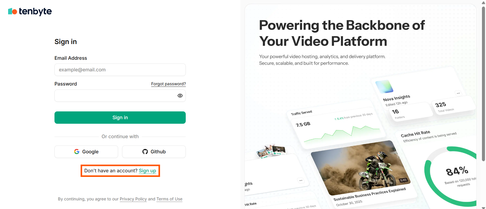
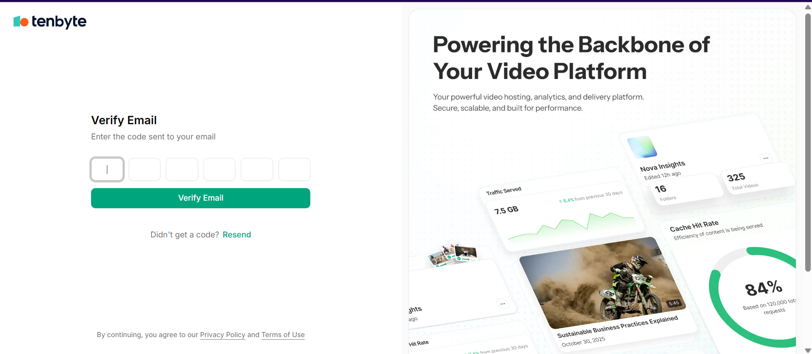
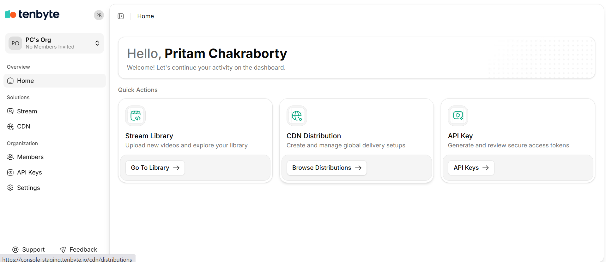
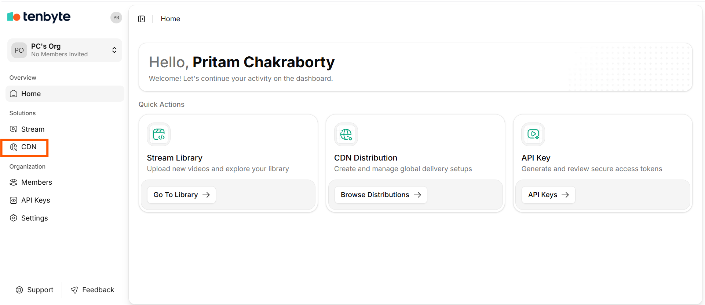
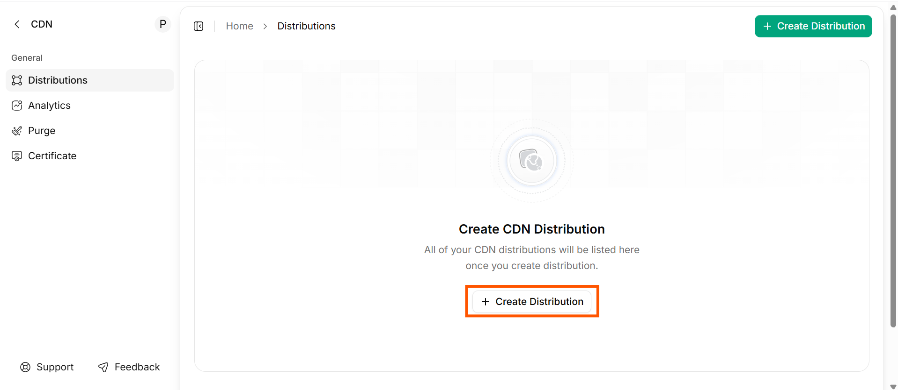

This guide explains how to access the Tenbyte CDN dashboard, navigate to the CDN section & prepare to create your first distribution.

## Step 01: Sign Up for a Tenbyte Account
1. Open your web browser and go to the [**Tenbyte website**](https://console.tenbyte.io/sign-in?redirect=%2F).
2. Click **Sign Up** in the bottom.

3. Fill in the required information:
    - Full Name
    - Email Address
    - Password
4. You will receive a **One-Time Password (OTP)** in your account email.
5. Enter the OTP in the verification field and click **Verify Email**.

6. Once verified, you will be automatically logged in to your account.

<Callout type="note">
    Tip: Use a valid email address that you have access to, as it is required for account verification and notifications.
</Callout>

## Step 02: Access the CDN Dashboard
1. You will be greeted with a Welcome page, providing an overview of the CDN features and options. 

2. From the Welcome page, you can start creating your first **CDN distribution**, view existing distributions, or access guides and resources.
3. After logging in, locate the left-hand navigation menu in your account dashboard.
4. Click **CDN** to open the Tenbyte CDN section.

5. After that click on **Create Distributions**.

It will take you to the **Tennbyte CDN Distribution** Page.
