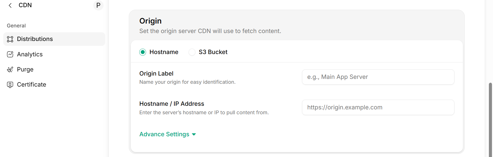
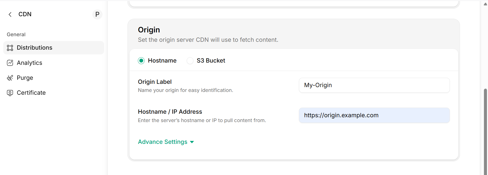
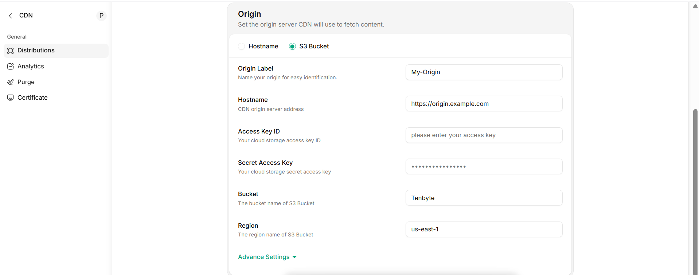
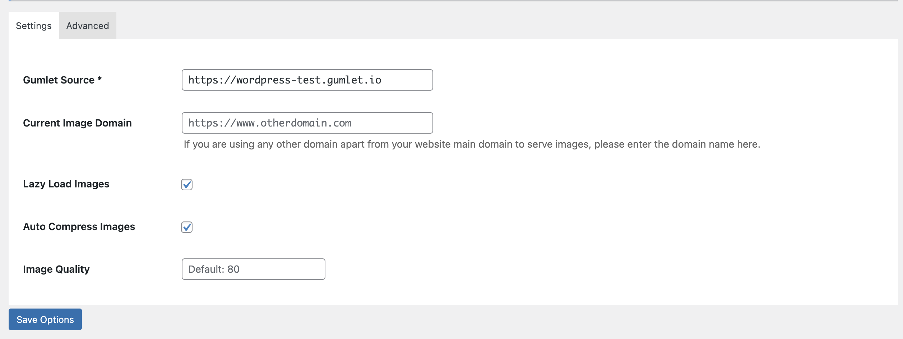
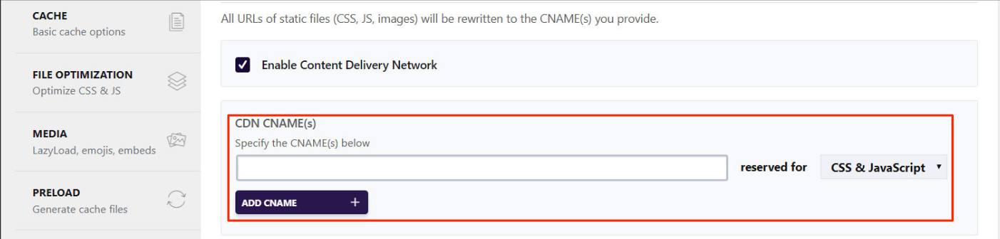
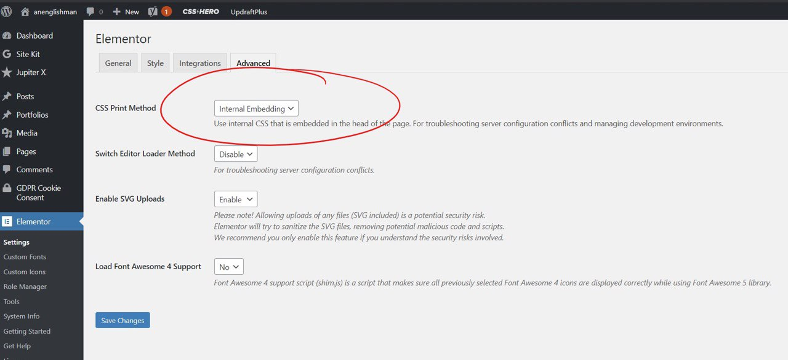
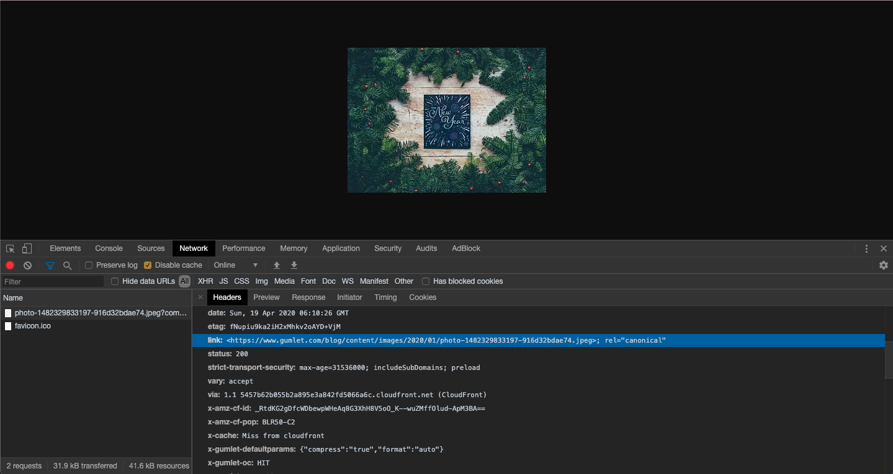
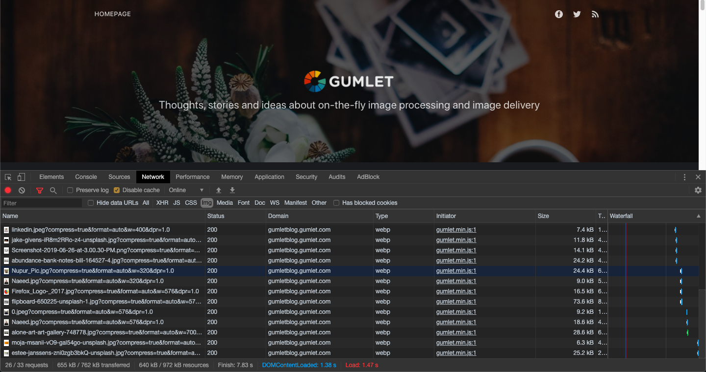
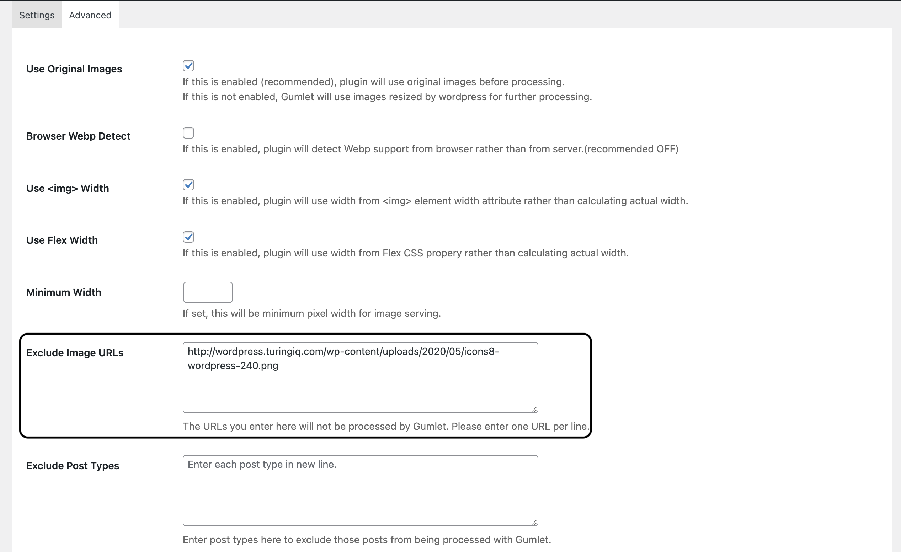
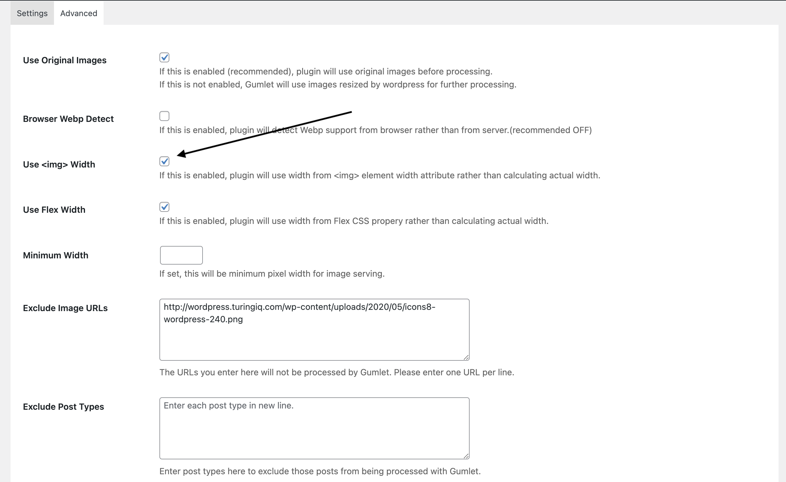

Here are the steps to integrate our Service with your Wordpress website 

High-quality images play a vital role in modern website design. They grab attention, enhance your brand, and keep users engaged. However, if not optimized properly, images can slow down your site and create a poor user experience.

Tenbyte CDN Image Optimization takes care of every aspect of delivering fast, high-quality images, ensuring your website loads quickly and looks great across all devices.

## **Key Features**

- **Automatic Image Resizing** – Images are automatically adjusted to fit each user’s device, so visitors always see the right size without wasting bandwidth.
- **Smart Compression** – Files are reduced in size using perceptually lossless compression, keeping images sharp while cutting down load time.
- **Modern Formats (WebP & Beyond)** – Images are served in next-gen formats like WebP whenever supported, reducing file size by up to 40% compared to JPEG without compromising quality.
- **Lazy Loading** – Images load only when they appear in view, improving page speed and user experience.
- **Global CDN Delivery** – Every optimized image is delivered through Tenbyte’s high-performance CDN, ensuring low latency and fast delivery worldwide.

## **Tenbyte** WordPress Integration Guide
Please follow these simple instructions closely, and your site should have optimized images in no time.
### 1. Create Account
Please create a Tenbyte account by [signing up](https://console.tenbyte.io/sign-in?redirect=%2F) and **log in** to your **Tenbyte** account.
### 2. Add a WordPress origin
We need to know where to fetch the original images for optimization. 

You can configure your origin in two ways:
1. **Manual Origin** – Add your origin by filling in the Origin Label and Hostname fields.

2. **S3 Bucket Origin** – Connect your S3 bucket by providing the S3 Origin Label, Hostname, Access Key, Bucket Name, and the Region where your bucket is stored.

### 3. Install and Configure Plugin
For Tenbyte CDN to work properly, it’s important to disable any other plugins or settings that handle lazy loading, image optimization, or image caching. Since Tenbyte CDN already manages these features, keeping other tools active may cause conflicts and prevent the service from working as intended.

Some popular themes, such as Brizy and Divi, include built-in lazy load options. Please review your theme settings and disable these features. If you are using a caching plugin like WP Rocket, make sure to turn off lazy load and exclude image file types from caching.

Once other lazy load and image optimization options are disabled, you can proceed to enable Tenbyte CDN Image Optimization for seamless delivery.

> <Info>**Brizy Builder?** If you are using the Brizy page builder, then please disable the Lazy load option. Brizy has an in-built lazy load that can not be disabled.</Info>

Go to **Plugins > Tenbte Plugin > Settings** on your WordPress dashboard, where you will see the below plugin settings screen.

Enter the subdomain created in Step 2 in the Tenbyte Origin field. Please make sure it is entered in **_https://wordpress-test.gumlet.ioformat_**. 

> <Info>**🚧Heads up!** Do not enter the Gumlet source in https://www.example.gumlet.io format..</Info>

Kindly leave the "Current Image Domain" field blank and other settings unchanged.

> <Info>**👍Ready!** Please save the settings and clear the WordPress cache, and you are done! Your images should be optimized and delivered via Tenbyte CDN.</Info>

Refer to the FAQ below in case you face any issues. Feel free to reach out to us over support chat or email (support@gumlet.com) if you need any further help.

> <Info>**📘For advance use cases only** If your images are loading from any other domain than your website domain, please enter that domain name in the Hostname Domain field.</Info>

### Bonus: Serve CSS and JS files via Tenbyte CDN
Our Tenbyte CDN accelerates the delivery of files through a global network. To ensure your website loads as quickly as possible, CSS and JavaScript files can also be delivered seamlessly over our CDN.

If you’re using a caching plugin like WP Rocket, setup is very simple:

1. In the top menu, click the WP Rocket link.
2. Navigate to the CDN tab.
3. Check the box “Enable Content Delivery Network.”
4. In the CDN CNAME(s) field, enter the Tenbyte CDN subdomain you created earlier (e.g., cdn.yourdomain.com).
5. In the Reserved For dropdown, select CSS & JavaScript.
6. Save the changes.
7. Clear your cache to apply the new settings.

**What if I don’t use WP Rocket?**

Even if you’re not using WP Rocket, there are many free caching plugins available for WordPress. We recommend WP Super Cache as a reliable option. You can follow our step-by-step guide to set up Tenbyte CDN with WP Super Cache. If you need additional help, feel free to reach out via our support chat or email.

**What if I don’t want to use any caching plugin?**

You can still deliver CSS and JS files through Tenbyte CDN, but this requires manually updating your WordPress site’s code.

For example:

    - Original file URL: https://example.com/path/to/file/cssFile.css
    - Updated Tenbyte CDN URL: https://cdn.example.com/path/to/file/cssFile.css

This method ensures your static files are served via the Tenbyte CDN subdomain. However, it may require advanced technical knowledge of WordPress file structures and theme editing.

## FAQs and Troubleshooting
How do I check if Tenbyte optimizes my images?
- Open your site in Google Chrome
- Right-click on any image
- Select "Open image in a new tab" from the menu
- If the image address starts from **`<yoursubdomain>.tenbyte.io`** then your images are being optimized by Tenbyte.
- Kindly note that our analytics panel updates every 45 minutes. Checking Analytics right after installing the plugin is not the right way to check if the plugin works.

### Does serving images from a Tenbyte subdomain affect my SEO?
No. Tenbyte CDN ensures that your image SEO remains intact by automatically sending a canonical link header to search engines. This is applied for all users without any additional configuration. You can verify this instantly in your browser’s Network tab.

It is also supported by lots of other WP plugins like ShortPixel and other CDN plugins.

### Why Are My Images Not Converted to WebP?

Tenbyte CDN automatically serves images in WebP format whenever the visitor’s browser supports it. The original image URLs do not change; the format conversion is communicated to the browser via the HTTP response header (MIME type). You can easily verify this using the Network tab in your browser’s developer tools.

If the Google Chrome browser does not show file type as WebP for your website, there is definitely a problem. Reach out to us on support channels, and we will fix it.

> <Info> 📘**AVIF Support:** Since Chrome v85, the AVIF image format is supported, offering up to 20% better compression than WebP at the same quality. Tenbyte CDN is among the first image optimization services to deliver images in AVIF format automatically when supported by the browser.</Info>

### How to Exclude Images from Tenbyte CDN Optimization

If there are certain images you don’t want optimized, you can easily exclude them:
1. Enter the original image URLs (e.g., https://www.yoursite.com/images/sea.jpeg) in the “Exclude Image URLs” box. Do not use the Tenbyte CDN URLs (e.g., https://cdn.yoursubdomain.tenbyte.io/sea.jpeg).
2. To exclude multiple images, add each URL on a new line in the box.

This allows you to selectively control which images are optimized while Tenbyte CDN continues to optimize the rest automatically.

### Why Are My Images Not Resized?

Sometimes, even after enabling Tenbyte CDN image optimization, speed tests may still recommend resizing your images. This often happens because some WordPress themes hardcode width and height attributes into `` tags, while modern web design relies on CSS for sizing.

By default, Tenbyte CDN’s responsive image resizing uses the `` tag’s width to avoid shrinking images unnecessarily. If tools like GTMetrix or Google PageSpeed Insights recommend resizing, you can fix this by:
- Going to Advanced Settings in the Tenbyte CDN plugin.
- Uncheck the option “Use `` width”.

This ensures Tenbyte CDN correctly resizes images based on their display size, improving load times and performance scores.

### The Tenbyte CDN Plugin Affects My Image Grid Layout – How to Fix It

Sometimes, enabling the Tenbyte CDN plugin may cause image grids on your site to display incorrectly.

To fix this:

- Go to the Advanced Settings in the Tenbyte CDN plugin panel.
- Uncheck the “Use Original Images” option.
- Clear your site cache.

This ensures that optimized images display correctly in grids and other layout components.